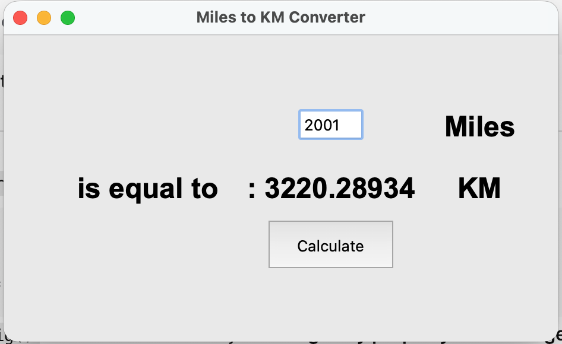

# 🛣️ Miles to KM Converter GUI

## 🚀 Project Overview

This repository hosts a simple, single-purpose graphical application (GUI) built using Python's standard **`tkinter`** library. The application provides a quick and easy way to convert distances entered in **miles** into their equivalent value in **kilometers**.

This project demonstrates foundational concepts in GUI programming, including:
*   Creating and arranging widgets using the `grid` layout manager.
*   Handling user input from an `Entry` field.
*   Processing button click events.
*   Dynamically updating a `Label` widget with the calculated result.

## ✨ Features

*   **Instant Conversion:** Calculates kilometers immediately upon clicking the "Calculate" button.
*   **Simple Interface:** A clean, minimal GUI focused on the conversion task.
*   **Built-in Library:** Developed solely using the standard Python `tkinter` library, requiring no external dependencies.
*   **Accurate Conversion:** Uses the standard conversion factor: $1 \text{ mile} \approx 1.60934 \text{ kilometers}$.

## 🖼️ Demo

Below is a screenshot of the application's user interface:



## ⚙️ Getting Started

### Prerequisites

To run this application, you only need a functional installation of **Python (version 3.x is recommended)**. The `tkinter` library is included by default with most Python installations.

### Installation & Execution

1.  **Clone the repository:**
    ```bash
    git clone https://github.com/dheerajdhami2001-cyber/miles_to_km.git
    cd miles_to_km
    ```

2.  **Run the application:**
    Execute the main script from your terminal:
    ```bash
    python main.py
    ```
    *(Assuming your Python file is saved as `main.py`)*

## 🛠️ Built With

*   **Language:** Python 3.x
*   **GUI Framework:** `tkinter` (The standard Python interface to the Tcl/Tk GUI toolkit)

##  Acknowledgments

This project was developed as an exercise within a comprehensive Python development course.

| **Course** | **Instructor** |
| :--- | :--- |
| **100 Days of Code: The Complete Python Pro Bootcamp** | **Dr. Angela Yu** (Developer and Lead Instructor) |
